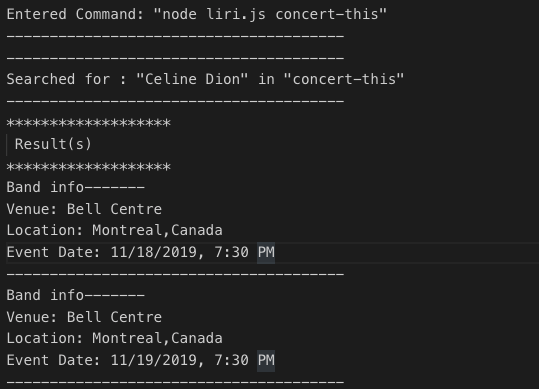

# Liri-Bot
This is Liri Bot Project which allows user to get Movie, Spotify and Bands in the Town info using Node

## Technologies used:

- Javascript
- Node.js

## Dependencies Used: 

```
"dependencies": {
    "axios": "^0.19.0",
    "dotenv": "^8.2.0",
    "json-stringify-safe": "^5.0.1",
    "moment": "^2.24.0",
    "node-spotify-api": "^1.1.1"
  }
```
## Some Examples:

- `node liri.js concert-this`

    
- `node liri.js concert-this we the kings`

    
- `node liri.js spotify-this -song`

    
- `node liri.js spotify-this-song tere mast mast`
    
    
- `node liri.js movie-this`

    
- `node liri.js movie-this avengers`

    
- `node liri.js do-what-it-says`

    
- `node liri.js invalid command`

    
